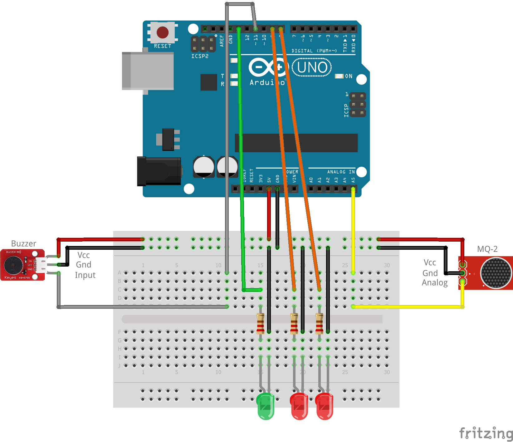

# fireplace-alarm

This project uses a MQ-2 gas sensor for arduino, a 3-pin buzzer and 3 LEDs (One green and 2 red).
The sensitivity of the MQ-2 sensor can be easily adjusted within the code from the sensorThres parameter.
Take into consideration that the gas sensor needs about 5 minutes to heat up in order to work properly. Also, try not to touch it with anything cold while it is working, as it briefly decreases it's accuracy. 

The project linking is displayed in the fritzing image.

